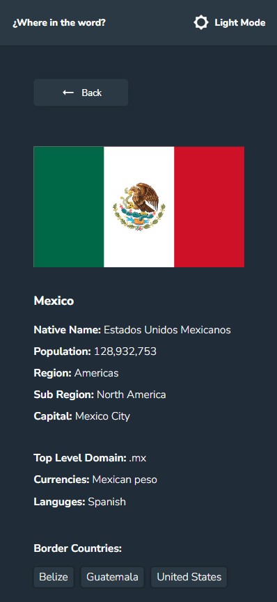

## Getting Started

First, run the development server:

```bash
npm run dev
# or
yarn dev
# or
pnpm dev
# or
bun dev
```

# Country-app- Reto

Este repositorio contiene el código fuente del reto realizado utilizando Next.js 13 con TypeScript, siguiendo una basada en el Atomic design. Se crearon los siguientes componentes: `Card`, `Dropdown`, `Header`,`Borders`, `CountriesList` y `Search`. Además, se implementaron dos páginas: `Home` y `Detail`.




## Tecnologías utilizadas

- Next.js 13
- TypeScript
- next-themes

## Componentes

### Card

El componente `Card` se encarga de renderizar una tarjeta con información relevante. Puede ser utilizado para mostrar detalles de un país, como su nombre, bandera, población, etc.

### Dropdown

El componente `Dropdown` es un menú desplegable que permite al usuario filtrar por la region.

### Header

El componente `Header` representa la cabecera de la página. contiene la opcion de cambiar de modo entre dark y light.

### Search

El componente `Search` es una barra de búsqueda que permite al usuario filtrar por el nombre del pais.

## Páginas

### Home

La página `Home` muestra una lista de países. Cada país se representa mediante el componente `Card`. El usuario puede hacer clic en un país para ver más detalles en la página `Detail`.

### Detail

La página `Detail` muestra información detallada sobre un país específico. Recibe el ID del país como parámetro y muestra los detalles correspondientes.

## Arquitectura

Arquitectura de Componentes (Component-Based Architecture): Esta arquitectura se centra en la construcción de la aplicación mediante la composición de componentes reutilizables. Cada componente tiene su propio estado interno y lógica

## Cómo ejecutar el proyecto

1. Clona este repositorio: `git clone <URL del repositorio>`
2. Navega al directorio del proyecto: `cd <nombre del directorio>`
3. Instala las dependencias: `npm install`
4. Inicia la aplicación: `npm run dev`
5. Abre tu navegador y ve a `http://localhost:3000`

¡Listo! Ahora puedes explorar la aplicación y ver los países en la página principal. Si haces clic en un país, podrás ver los detalles en la página de detalle.

